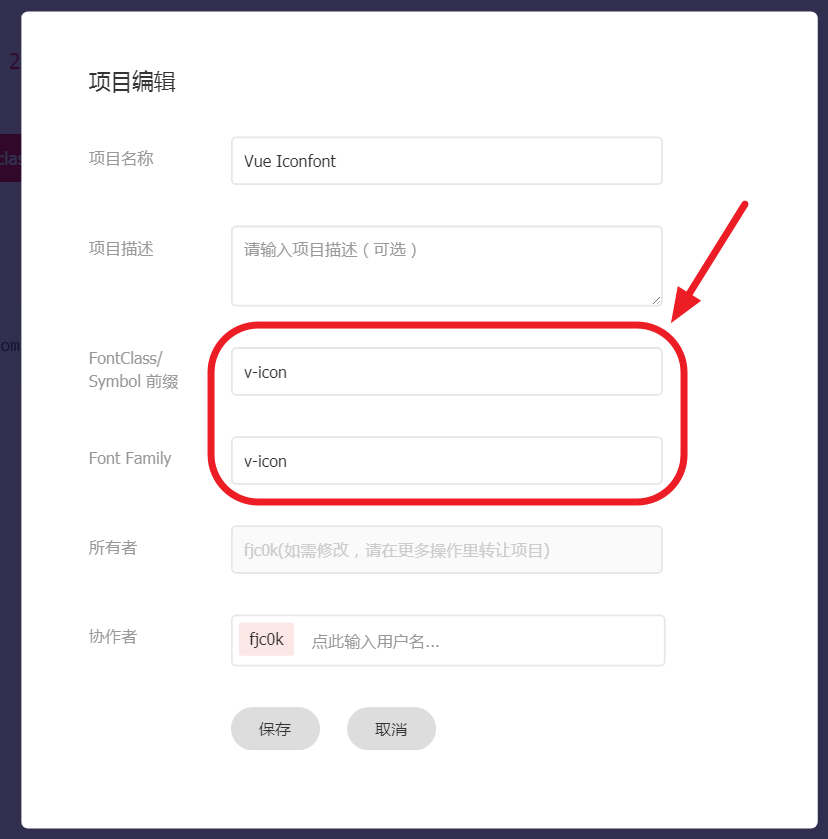

# Vue Iconfont

[](https://travis-ci.org/fjc0k/vue-iconfont)
[](https://codecov.io/gh/fjc0k/vue-iconfont)
[](https://github.com/fjc0k/vue-iconfont/blob/master/dist/vue-iconfont.min.js)
[](https://github.com/fjc0k/vue-iconfont/blob/master/dist/vue-iconfont.min.js)

更优雅地使用 [Iconfont.cn](http://iconfont.cn)，同时支持 `font-class 引入` 和 `symbol 引入`。

## 安装

```bash
# Yarn
yarn add vue-iconfont

# npm
npm i vue-iconfont
```

CDN：[jsDelivr](//www.jsdelivr.com/package/npm/vue-iconfont) | [UNPKG](//unpkg.com/vue-iconfont/) （可通过 `window.VueIconfont` 使用）

## 使用

首先用 `Vue.use` 安装 `VueIconfont`：

```js
import Vue from 'vue'
import VueIconfont from 'vue-iconfont'

Vue.use(VueIconfont/*, options*/)

// ......
```

然后就可以在组件中这样使用：

```html
<icon name="right" />
```

#### options

选项 | 类型 | 默认值 | 说明
--- | --|--|--
tag | `String` | `icon` | 图标组件的标签。
type | `font` &#124; `svg` | `font` | `font`：表示用 font-class 引入的字体图标。<br />`svg`：表示用 symbol 引入的 SVG 图标。
prefix | `String` | `icon` | 表示类名前缀或 SVG 图标名称前缀。
family | `String` | `= prefix` | 仅当 `type` 为 `font` 时有效，表示设置了 `font-family` 样式的类。


## 完整实例

### 项目配置

1. 打开 [iconfont.cn](http://iconfont.cn) 的 `图标管理 > 我的项目`，选择一个项目。

2. 点击 `更多操作 > 编辑项目`：


3. 将 `FontClass/Symbol 前缀` 和 `Font Family` 表单项设为同一个值，这个值就是上面 `options` 中的 `prefix`：



4. 点击 `下载至本地` 将图标文件下载解压到项目文件夹中。

### 安装

你可以使用 `Vue.use(VueIconfont, [options1, options2, ..., optionsN])` 按需定义不同的图标组件。

```js
// index.js
import Vue from 'vue'
import VueIconfont from 'vue-iconfont'
import App from './app.vue'

// 引入上面下载得到的使用 font-class 图标必须的 css 文件
import './iconfont/iconfont.css'

// 引入上面下载得到的使用 SVG 图标必须的 js 文件
import './iconfont/iconfont.js'

Vue.use(VueIconfont, [
  // 定义 v-icon 组件以使用 font-class 图标
  {
    tag: 'v-icon',
    prefix: 'v-icon',
    type: 'font'
  },

  // 定义 v-svg-icon 组件以使用 SVG 图标
  {
    tag: 'v-svg-icon',
    prefix: 'v-icon',
    type: 'svg'
  }
])

new Vue({
  el: '#app',
  render: h => h(App)
})
```

### 使用

```html
<!-- app.vue -->
<template>
  <div>
    <v-icon name="right" />
    <v-svg-icon name="right" />
  </div>
</template>
```

#### 如何设置图标颜色、大小等？

直接设置其 CSS 即可：

```html
<v-icon name="right" style="color: red; font-size: 2em;" />
<v-svg-icon name="right" style="color: blue; font-size: 14px;" />
```
